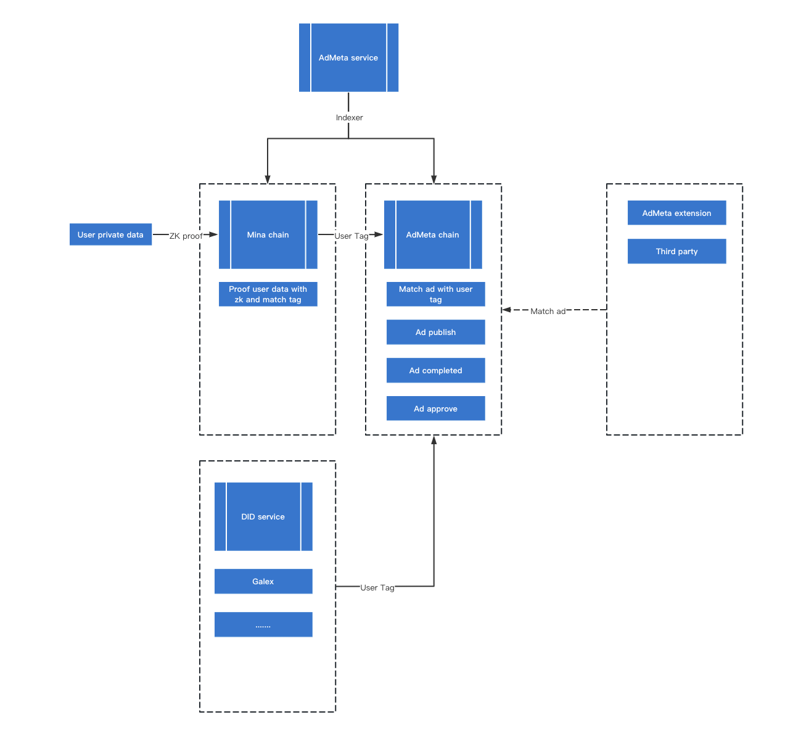

### AdMeta x Mina

# Project Introduction
AdMeta provides services in both Mina and EVM contracts. In Mina, AdMeta calculates users' tag (such as GameFi) while ensuring the privacy of their browsing history. The EVM contract is mainly used to publish advertisements and match them with users. AdMeta matches ads with users based on the Tag previously calculated by Mina. Users will receive rewards for completing advertisements. In addition to calculating user Tags through Mina, AdMeta also interfaces with some DID service providers to gain more users. The advertisement display will ultimately appear on the AdMeta Extension and third-party platforms that cooperate with AdMeta. To ensure data accuracy, AdMeta provides a backend synchronization service for data synchronization.

# License
GPLv3
